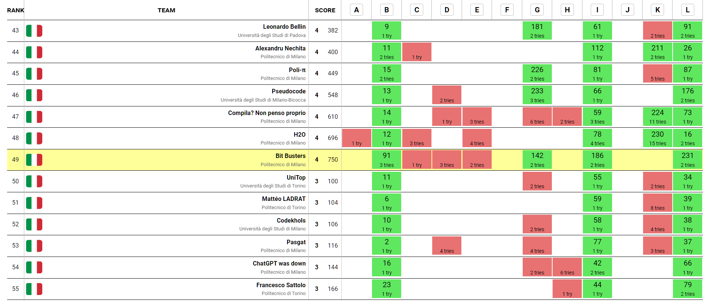

# ITACPC23-BitBusters
Repo of the final problems solved during the competition [ITACPC 2023](https://www.itacpc.it/home) by the team Bit Busters, composed by:
- [Fausto Allegrini](https://github.com/fausto555)
- [Lorenzo Pegorari](https://github.com/LorenzoPegorari)
- [Giovanni Alberto Sartorato](https://github.com/giovannialbertos)

We solved 4 out of 12 problems in 240 minutes, and we ranked:
- 49th out of all the 303 teams (617 people),
- 14th out of the 97 teams (196 students) of Politecnico di Milano.

